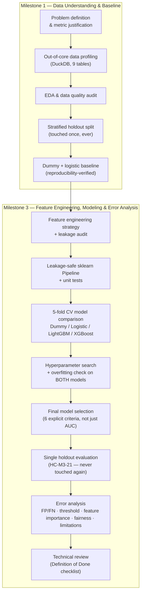

# Home Credit Default Risk

[](https://github.com/shadmanArko/home-credit-default-risk/actions/workflows/ci.yml)


A leakage-audited, reproducible machine learning pipeline that predicts a loan
applicant's probability of default, built end-to-end on the
[Home Credit Default Risk](https://www.kaggle.com/competitions/home-credit-default-risk)
Kaggle dataset (9 tables, ~2.9 GB, ~308K applicants).

This is not a single notebook that trains a model and stops. It is a
milestone-by-milestone engineering exercise — data understanding, feature
engineering, leakage auditing, model selection under cross-validation, a
deliberate (and deliberately *not automatic*) hyperparameter-tuning decision,
one single untouched holdout evaluation, and a full error-analysis pass —
with every claim in this README backed by a number computed somewhere in this
repository, not asserted from memory.

**Headline result:** an untuned LightGBM model scores **0.7791 ROC-AUC** on a
holdout set it never influenced — **+0.2791 over the 0.5000 dummy floor** and
**+0.0302 over a naive linear-model-on-raw-features baseline (0.7489)** —
with a business-driven decision threshold (0.485, chosen against an explicit
70% recall floor) rather than a default 0.5 cutoff.

---

## Table of contents

- [Results at a glance](#results-at-a-glance)
- [How this was built — workflow & methodology](#how-this-was-built--workflow--methodology)
- [Engineering principles applied throughout](#engineering-principles-applied-throughout)
- [Project status](#project-status)
- [Repository structure](#repository-structure)
- [Getting started](#getting-started)
- [Data pipeline](#data-pipeline)
- [Modeling pipeline](#modeling-pipeline)
- [MLOps & deployment (Milestone 4)](#mlops--deployment-milestone-4)
- [Testing & CI](#testing--ci)
- [Tech stack](#tech-stack)
- [Known limitations & future work](#known-limitations--future-work)
- [Milestone reports](#milestone-reports)

---

## Results at a glance

| Metric | Value | Compared to |
|---|---|---|
| **Holdout ROC-AUC** (final model, evaluated once) | **0.7791** | Dummy floor: 0.5000 · M1 linear baseline: 0.7489 |
| **Development-pool CV ROC-AUC** | 0.7747 ± 0.0020 | Holdout matched/exceeded this (+0.0044) — no overfitting |
| **Holdout PR-AUC** | 0.2758 | vs. ~0.081 base rate (positive class prevalence) |
| **Chosen decision threshold** | 0.485 | Chosen to satisfy a 70% recall floor, not defaulted to 0.5 |
| **Recall / Precision at chosen threshold** | 0.701 / 0.174 | Deliberately recall-favoring — see [why](#threshold-selection) |
| **Unit tests** | 39 passing | `src/home_credit_default_risk/` package, not notebook-only logic |
| **Feature engineering lift** | +0.0108 ROC-AUC | Engineered features vs. raw `application` columns, model held fixed (0.7550 vs. 0.7442, logistic regression) |

**Model comparison (5-fold stratified CV, identical folds, engineered features):**

| Model | CV ROC-AUC | Notes |
|---|---|---|
| `DummyClassifier` | 0.5000 | Floor |
| Logistic Regression | 0.7550 | Linear baseline on the full engineered feature set |
| XGBoost | 0.7579 | Given a fair, comparable setup — still lost to LightGBM |
| **LightGBM (untuned)** | **0.7747** | **Selected as final model** |
| LightGBM (tuned, `RandomizedSearchCV`) | 0.7778 | **Rejected** — more than double the overfitting gap for a +0.0032 gain |

Full experiment ledger with every model/feature-set/tuning combination ever
run: [`reports/experiments.csv`](reports/experiments.csv).

---

## How this was built — workflow & methodology

This project was run as two structured milestones, each broken into small,
independently reviewable tickets (`HC-M1-01` … `HC-M1-10`, `HC-M3-01` …
`HC-M3-29`) — the same granularity a Jira-driven sprint would use, applied
solo. Every ticket has a stated acceptance criteria and closes with a
notebook section that satisfies it explicitly, so the notebooks double as a
running audit trail of *why* each decision was made, not just *what* the
final answer was.



**The discipline that made this more than a script that trains a model:**

1. **Confirm before you build.** `HC-M3-01` re-confirmed the target, metric,
   and business framing before any modeling started — cheap insurance
   against optimizing the wrong thing for two milestones.
2. **One holdout, touched exactly once.** The train/holdout split was drawn
   in Milestone 1 and never redrawn. Every candidate model, every
   hyperparameter search, and every threshold decision in Milestone 3 was
   evaluated on cross-validated *development-pool* predictions — the holdout
   was reserved for a single, final evaluation (`HC-M3-21`), verified for
   this README by re-exporting the notebook and grepping every reference to
   confirm it, not assumed from the surrounding prose.
3. **Investigate, don't assume.** Every quantitative claim in this
   repository — a leakage risk, a correlation, a threshold's precision/recall
   trade-off, a fairness gap — is backed by a specific computation in a
   specific notebook cell or script, not a plausible-sounding guess.
4. **Report the result you get, not the one you expect.** The hyperparameter
   search found a configuration that scored *higher* on cross-validated
   ROC-AUC — and it was rejected anyway, because it overfit substantially
   more for a gain smaller than this dataset's fold-to-fold noise
   (`HC-M3-18`). A tuned model that reports worse generalization risk for a
   marginal metric gain is not automatically the better model.
5. **Business cost drives the threshold, not the metric's default.** ROC-AUC
   is a ranking metric and says nothing about where to draw the approve/reject
   line. `HC-M3-25` derived that line from the dataset's actual cost
   asymmetry (a missed default costs more than a wrongly rejected good
   client) against leakage-safe out-of-fold predictions — never against the
   holdout, and never defaulting to 0.5 without checking.
6. **A number without a caveat is a number nobody should trust.** The final
   write-up documents run-to-run non-determinism discovered in this
   project's own re-runs (LightGBM/XGBoost's multi-threaded training,
   `RandomizedSearchCV`'s search-order sensitivity), a measured recall gap
   by gender that is reported without over-claiming its cause, and an
   explicit "what this model has *not* been shown to do" statement
   (`HC-M3-27`) — see [Known limitations](#known-limitations--future-work).

## Engineering principles applied throughout

- **Reproducibility over convenience.** `config.RANDOM_STATE = 42` threads
  through every split, model, and search. Milestone 1's baseline numbers
  were verified from a full clean-room rebuild
  ([`reports/reproducibility_check.md`](reports/reproducibility_check.md)),
  not just re-run once and trusted.
- **Leakage-safety by construction, not by discipline alone.** Preprocessing
  (`ColumnTransformer`) is only ever fit inside a `Pipeline.fit()` call on a
  training fold; feature engineering functions are pure, stateless, and
  never accept the target column — enforced by unit tests, not convention.
- **A real Python package, not notebook-only logic.** Feature engineering,
  historical aggregations, the preprocessing pipeline, and the CV harness
  all live in `src/home_credit_default_risk/`, covered by **39 unit tests**
  (`tests/`) that run independently of the real 2.9 GB dataset via synthetic
  fixtures with hand-computed expected values.
- **Data platform patterns applied to a Kaggle dataset.** Rather than
  re-parsing multi-gigabyte CSVs in every notebook, raw data is landed once
  into DuckDB and profiled with a scalable, out-of-core engine — the same
  "compute once, store as metadata, read everywhere" pattern real data
  platforms use for data catalogs.
- **CI enforced, not just claimed.** Every push and pull request runs the
  same `ruff check` and `pytest` this README claims pass —
  [`.github/workflows/ci.yml`](.github/workflows/ci.yml).

## Project status

✅ **Milestone 1** (data understanding + baseline modeling) — complete.
✅ **Milestone 3** (feature engineering, modeling, error analysis) — complete.
🚧 **Milestone 4** (MLOps & deployment — model registry, feature store,
serving, monitoring, cloud deployment) — in progress, built one reviewed
chunk at a time. See [MLOps & deployment](#mlops--deployment-milestone-4).
⬜ Kaggle competition submission — not yet attempted (this project's scope so
far is a rigorously validated local pipeline, not a leaderboard score).

| Stage | Status |
|---|---|
| Environment, tooling, CI (uv, Ruff, pytest, GitHub Actions) | ✅ |
| Data pipeline (download, DuckDB profiling, data dictionary, quality audit) | ✅ |
| Exploratory data analysis | ✅ |
| Holdout strategy (drawn once, reused everywhere) | ✅ |
| Baseline modeling (dummy + logistic regression) | ✅ |
| Feature engineering (ratios, age/employment, 3 historical aggregation groups) | ✅ |
| Feature leakage audit | ✅ |
| Leakage-safe preprocessing pipeline + tests | ✅ |
| Model selection under 5-fold CV (Dummy / Logistic / LightGBM / XGBoost) | ✅ |
| Hyperparameter tuning (evaluated and deliberately rejected) | ✅ |
| Final holdout evaluation (touched exactly once) | ✅ |
| Error analysis (false positives/negatives, threshold, feature importance, fairness, limitations) | ✅ |
| Final experiment summary & technical review | ✅ |
| Final model artifact persisted (`models/`, `scripts/train_final_model.py`) | ✅ |
| Kaggle test-set submission | ⬜ |

## Repository structure

```text
home-credit-default-risk/
│
├── .github/
│   └── workflows/
│       └── ci.yml                     # Lint (Ruff) + test (pytest) on every push/PR
│
├── data/
│   ├── raw/                           # gitignored — scripts/download_data.py fetches it
│   ├── interim/                       # train_valid_split.csv (regenerable, HC-M1-05)
│   └── processed/
│
├── docs/
│   ├── problem_definition.md          # HC-M1-01 / HC-M3-01 — target, metric, cost asymmetry
│   ├── feature_engineering_strategy.md  # HC-M3-04 — every candidate feature, rationale, leakage risk
│   └── feature_leakage_audit.md       # HC-M3-07 — six-category leakage audit, real findings
│
├── notebooks/
│   ├── 01_data_understanding.ipynb    # HC-M1-02..04 — profiling, EDA, data quality
│   ├── 02_baseline_model.ipynb        # HC-M1-05..10 — split, baselines, reproducibility
│   ├── 03_feature_engineering.ipynb   # HC-M3-02..07 — features, leakage audit
│   └── 04_modeling.ipynb              # HC-M3-08..29 — CV, tuning, holdout, error analysis
│
├── src/home_credit_default_risk/      # Importable package — not notebook-only logic
│   ├── config.py                      # Single source of truth: seed, split, CV, metric, MLOps config
│   ├── features.py                    # Ratio/age/employment feature engineering
│   ├── aggregations.py                # bureau / previous_application / payment-history aggregations
│   ├── pipeline.py                    # build_feature_matrix() + leakage-safe build_preprocessor()
│   ├── cv.py                          # Stratified K-fold CV harness
│   ├── utils.py                       # safe_divide() and other shared helpers
│   ├── domain/                        # HC-M4 — pure business logic, zero third-party imports
│   │   ├── ports.py                   #   FeatureStore, ModelRegistry (abstract interfaces)
│   │   └── scoring.py                 #   decide() — the HC-M3-25 threshold, applied
│   ├── application/                   # HC-M4 — use cases orchestrating the ports
│   │   ├── score.py                   #   ScoreApplicantUseCase — known SK_ID_CURR
│   │   └── score_new_applicant.py     #   ScoreNewApplicantUseCase — brand-new applicant
│   └── adapters/                      # HC-M4 — concrete implementations of the ports
│       ├── mlflow_registry.py         #   MlflowModelRegistry (cached, versioned model loads)
│       ├── local_store.py             #   LocalFeatureStore (Feast evaluated + rejected, see below)
│       └── api/
│           ├── main.py                #   FastAPI composition root — /score, /apply, /health
│           └── static/index.html      #   One-page demo form, served at "/"
│
├── scripts/
│   ├── download_data.py               # Kaggle → data/raw/
│   ├── profile_data.py                # Out-of-core DuckDB profiling → reports/data_profile/
│   ├── build_data_dictionary.py       # Profiles + official docs → reports/data_dictionary.md
│   ├── generate_data_quality_summary.py  # Duplicate/orphan-rate scorecard across all tables
│   ├── generate_eda_report.py         # Sweetviz train-vs-test drift report
│   ├── train_final_model.py           # Reproduces HC-M3-20's fit, saves models/*.joblib
│   ├── train_with_mlflow.py           # Same fit, registered + promoted via MLflow instead
│   ├── materialize_features.py        # Builds the offline feature store (Parquet)
│   ├── benchmark_feature_lookup.py    # Real before/after feature-lookup timing
│   └── score_batch.py                 # Batch-scoring CLI composition root
│
├── tests/                             # 67 tests — package code + FastAPI route logic
│
├── models/                            # Trained artifacts (gitignored — regenerate via the script above)
│
├── Dockerfile                         # Serving image (FastAPI + Uvicorn)
├── docker-compose.yml                 # `train` (materialize + register) + `api` (serve) services
│
├── reports/
│   ├── data_profile/*.json            # Per-table profiles (committed; cache DB is gitignored)
│   ├── data_dictionary.md             # Column-level reference, stats + business description
│   ├── data_quality_summary.md        # Duplicate/orphan-rate scorecard, all 9 tables
│   ├── reproducibility_check.md       # Clean-room rebuild verification
│   ├── experiments.csv                # Every experiment, model, feature set, tuning, CV/holdout AUC
│   └── holdout_prediction_analysis.csv  # Regenerable — HC-M3-22's per-row prediction dataset
│
├── pyproject.toml
├── uv.lock
└── README.md
```

## Getting started

```bash
# 1. Install dependencies (Python 3.12, managed by uv)
uv sync

# 2. Fetch the raw Kaggle dataset (requires Kaggle API credentials)
uv run python scripts/download_data.py

# 3. Profile the data and build the reference artifacts
uv run python scripts/profile_data.py
uv run python scripts/build_data_dictionary.py
uv run python scripts/generate_data_quality_summary.py

# 4. Open the notebooks in order, or run the test suite directly
uv run jupyter lab
uv run pytest -q

# 5. Regenerate the final model artifact without re-running the full notebook
uv run python scripts/train_final_model.py

# 6. Or run the full served API in Docker (materializes features, trains
#    + registers the model, then serves it on http://localhost:8000)
docker compose up -d api
curl -X POST localhost:8000/score -H "Content-Type: application/json" \
  -d '{"sk_id_curr": 100001}'

# 7. Or open http://localhost:8000/ in a browser for a one-page demo
#    form that scores a brand-new applicant (POST /apply under the hood)
```

## Data pipeline

The raw dataset is ~2.9 GB across 9 tables and will only grow in future
projects, so it is never loaded into pandas wholesale just to answer "what
does this data look like." Instead:

1. **`scripts/profile_data.py`** lands each raw CSV once into a local DuckDB
   table (a single text parse) and computes full-table aggregates — row/column
   counts, per-column null rate, cardinality, numeric stats, top categorical
   values, primary-key uniqueness, and foreign-key orphan rates against the
   `SK_ID_CURR` spine — using DuckDB's out-of-core vectorized engine, which
   never requires the full file to fit in memory. Output: one JSON per table
   in `reports/data_profile/`.
2. **`scripts/build_data_dictionary.py`** merges those JSON profiles with the
   official `HomeCredit_columns_description.csv` into a single
   `reports/data_dictionary.md` — a compact, versioned reference with real
   statistics and business descriptions side by side.
3. **`scripts/generate_data_quality_summary.py`** consolidates every table's
   full-row duplicate count and every declared foreign-key relationship's
   orphan rate — not just single-column FK-to-spine checks, but arbitrary
   table-to-table relationships (e.g. `bureau_balance -> bureau`,
   `POS_CASH_balance.SK_ID_PREV -> previous_application`) — into one
   scorecard, `reports/data_quality_summary.md`.

Both the profile JSONs and the data dictionary are committed to git — the
reference for understanding the dataset going forward, rather than
re-reading or re-summarizing the raw CSVs each time. This mirrors how real
data platforms build data catalogs (compute stats once with a scalable
engine, store as metadata, read the metadata everywhere else), and scales
unchanged from this dataset's ~1 GB tables to files far larger than
available RAM.

**Visual EDA (Sweetviz):** `scripts/generate_eda_report.py` generates a
train-vs-test drift report (`reports/eda_train_vs_test_compare.html`, not
committed — regenerate locally). `ydata-profiling` was evaluated and
rejected: its pandas version pins conflict with this project's `pandas>=3.0.5`
with no way to satisfy both, documented rather than silently worked around.
The report deliberately excludes `TARGET` and pairwise feature associations —
per this project's EDA discipline, feature-vs-target analysis is deferred
until after the holdout split and computed on the training fold only.

## Modeling pipeline

**Feature engineering** (`HC-M3-05`/`06`, [`docs/feature_engineering_strategy.md`](docs/feature_engineering_strategy.md)):
ratio features (credit-to-income, annuity-to-income, credit-to-annuity),
age/employment features (with the `DAYS_EMPLOYED` 365,243-day sentinel
correctly recoded to `NaN`), and historical aggregations from `bureau`,
`previous_application`, and payment-behavior tables — 149 columns total, up
from the 122 raw `application` columns. Every candidate feature was checked
against a six-category leakage audit
([`docs/feature_leakage_audit.md`](docs/feature_leakage_audit.md)) before
use; real findings were investigated and explicitly accepted or deferred,
never silently ignored.

**Leakage-safe pipeline** (`HC-M3-09`, `src/home_credit_default_risk/pipeline.py`):
feature engineering is pure and stateless (safe to apply once, since it fits
nothing); preprocessing (median/most-frequent imputation, `RobustScaler`,
one-hot encoding) is an *unfitted* `ColumnTransformer`, fit only inside a
`Pipeline.fit()` call on a training fold — never on validation or holdout
rows.

**Model selection** (`HC-M3-11`–`19`): five candidates compared on identical
5-fold stratified CV folds — a dummy floor, logistic regression (both on raw
and engineered features, isolating the feature-engineering effect), LightGBM,
and XGBoost. LightGBM won by a margin well beyond fold-to-fold noise. A
30-candidate `RandomizedSearchCV` then found a configuration scoring higher
on CV — but with more than double the train-vs-CV overfitting gap, so it was
rejected in favor of the untuned defaults, selected against six explicit
criteria (performance, stability, complexity, interpretability, runtime,
business suitability), not ROC-AUC alone.

**Final holdout evaluation** (`HC-M3-20`/`21`): the frozen configuration is
fit once on the full 246,008-row development pool and evaluated exactly once
on the 61,503-row holdout, which had never influenced any prior decision —
**0.7791 ROC-AUC**, +0.0044 above the CV estimate (the favorable direction:
no overfitting).

### Threshold selection

ROC-AUC measures ranking quality and is fixed once the model is trained —
choosing a classification threshold only trades precision against recall,
never changes the ranking metric. `HC-M3-25` derived the threshold from
**leakage-safe out-of-fold predictions on the development pool**
(`cross_val_predict`, never the holdout — reusing an already-evaluated
holdout to pick a threshold would be exactly the repeated-peeking leakage
this project's holdout discipline exists to prevent).

Because a missed default costs Home Credit more than a wrongly rejected good
client (see [`docs/problem_definition.md`](docs/problem_definition.md) §1),
the threshold was chosen to satisfy an explicit **70% recall floor** on
defaulters, then maximize precision subject to that floor — landing at
**0.485** (precision 0.174, recall 0.701, F1 0.279, 32.5% of applicants
flagged), a deliberately recall-favoring choice rather than the F1-maximizing
threshold (~0.65–0.70) or the untested default of 0.5.

### Error analysis & interpretation

- **False positive/negative analysis** (`HC-M3-23`/`24`): false positives
  (27.4% of actual negatives) and false negatives (30.5% of actual positives)
  were compared against correctly classified applicants across income,
  credit, age, employment, and the three `EXT_SOURCE_*` bureau scores, with
  visualizations and documented business implications for each.
- **Feature importance** (`HC-M3-26`): gain-based LightGBM importance (not
  the library's split-count default, which was explicitly rejected as less
  business-relevant) shows the three `EXT_SOURCE_*` scores account for
  **~48% of total model gain**, with this project's own engineered features
  (`credit_to_annuity`, `late_payment_rate`, `cc_mean_utilization`, and
  others) earning real, meaningful weight in the top 12 — concrete evidence
  the feature engineering work mattered, not just a CV number. Interpreted
  with an explicit disclaimer: feature importance shows what the model
  *uses*, never what *causes* default.
- **Model limitations & fairness** (`HC-M3-27`): a real subgroup check found
  recall differs by `CODE_GENDER` (79.3% for men vs. 65.0% for women) at the
  chosen threshold, while ROC-AUC is close between groups (0.781 vs. 0.771)
  — reported honestly, without over-claiming the cause, alongside data,
  model, feature, and validation limitations and concrete future
  improvements. See [Known limitations](#known-limitations--future-work).

## MLOps & deployment (Milestone 4)

Everything above produces a *validated* model; nothing in Milestones 1–3
can actually serve a prediction. Milestone 4 closes that gap with a real
MLOps stack — a model registry, a feature store, a served API, monitoring,
and (last) a cloud deployment — built as six independently-reviewed
chunks (`HC-M4-*`), one at a time, rather than all at once.

**Architecture discipline applied throughout**: Clean Architecture's
Dependency Rule. Business logic (`domain/`, `application/`) never imports
an infrastructure library directly — it depends on small, explicit
interfaces (`domain/ports.py`), and concrete tools (MLflow, and later
Feast/FastAPI) live behind adapters that implement them. This means, for
example, that swapping the feature store implementation later requires
touching zero lines in the code that actually decides how to score an
applicant.

### Chunk 1 — Experiment tracking & model registry (`HC-M4-01`–`03`) ✅

- **Why**: before this chunk, the "final model" was a single loose
  `models/lightgbm_final_pipeline.joblib` file with no version history and
  no record of what parameters/metrics produced it beyond this README.
- **What**: a `ModelRegistry` port (`src/home_credit_default_risk/domain/ports.py`)
  and an MLflow-backed adapter
  (`src/home_credit_default_risk/adapters/mlflow_registry.py`) that logs
  every training run's parameters and metrics, versions the fitted
  pipeline, and promotes a version to a `production` alias.
  `scripts/train_with_mlflow.py` runs the exact same training recipe as
  `scripts/train_final_model.py` (shared, not duplicated) through this
  registry instead of a loose file.
- **A real dependency conflict, resolved and documented rather than
  silently worked around** (this project's established pattern — see
  `ydata-profiling` in [Data pipeline](#data-pipeline)): the full `mlflow`
  package requires `pandas<3`, incompatible with this project's
  `pandas>=3.0.5`. Solved with `mlflow-skinny` (no such pin) plus a small
  `mlflow.pyfunc` wrapper in place of the unavailable `mlflow.sklearn`
  flavor — same registry functionality, no dependency conflict.
- **Verified for real**, not just unit-tested: ran
  `scripts/train_with_mlflow.py` against the actual 246,008-row
  development pool, confirmed the registered model is retrievable via
  `mlflow.client.MlflowClient.get_model_version_by_alias` and returns
  real, valid probabilities (`[0, 1]`) for real applicants — plus 4 new
  unit tests (`tests/test_mlflow_registry.py`) against a temporary SQLite
  store, none of which touch the real dataset.

### Chunk 2 — Feature store (`HC-M4-04`–`07`) ✅

- **Why**: `build_historical_features()` (`aggregations.py`, `HC-M3-06`)
  recomputes a full-table aggregation over `bureau`/`previous_application`/
  payment-history *every time it runs* — fine for a one-time batch, wrong
  for scoring one applicant on demand. There was no fast path to one
  applicant's feature vector before this chunk.
- **Feast was evaluated and rejected**: every released version (`0.20`
  through `0.65`, the full available range) requires `pandas<3`,
  incompatible with this project's `pandas>=3.0.5` — the same class of
  conflict as `ydata-profiling` and the full `mlflow` package, except
  Feast has no "skinny" escape hatch since pandas is load-bearing in its
  core, not an optional extra. Documented rather than silently worked
  around, per this project's standing practice.
- **What was built instead, behind the same `FeatureStore` port**
  (`domain/ports.py`) so nothing above this seam would need to change
  regardless of which adapter satisfies it (Liskov Substitution): a
  materialization script (`scripts/materialize_features.py`) that runs
  `build_historical_features()` **once**, now over *every* applicant in
  `application_train` **and** `application_test` (356,255 rows, not just
  the 246,008-row development pool) and writes the result to
  `data/processed/historical_features.parquet` — this project's offline
  feature store. `LocalFeatureStore`
  (`src/home_credit_default_risk/adapters/local_store.py`) loads that
  file once and serves O(1) in-memory lookups by `SK_ID_CURR` — the
  online store.
- **Real, measured result** (`scripts/benchmark_feature_lookup.py`):
  recomputing one applicant's features from the raw tables takes
  **~650–930ms**; looking that same applicant up in `LocalFeatureStore`
  takes **~0.013ms** — a **~50,000–70,000× speedup**, run twice to check
  it wasn't a fluke. This is the concrete fix for the exact bottleneck
  identified in this chunk's own "why."
- **Honest scope limit, stated rather than hidden**: this store only
  covers applicants already present in the raw Kaggle tables (train +
  test) — a genuinely new applicant with no landed history row would
  need `materialize_features.py` re-run (or a true incremental-update
  path, out of scope for a local, single-node demo) before being
  scoreable. Documented here, not discovered later.

### Chunk 3 — Serving: FastAPI + Docker (`HC-M4-08`–`11`) ✅

- **`domain/scoring.py`**: a pure `decide(probability, threshold)` function
  and a frozen `Decision` dataclass — the `HC-M3-25` threshold (0.485) now
  lives here as an explicit business rule, not a magic number scattered
  across entrypoints.
- **`application/score.py`**: `ScoreApplicantUseCase`, constructed with a
  `FeatureStore` and a `ModelRegistry` (both ports, injected — never a
  concrete Feast/MLflow import). It fetches an applicant's materialized
  features, applies `HC-M3-05`'s `add_basic_features()` (the ratio/age
  features were never part of the feature store, since they were never
  the bottleneck `HC-M4-04` identified), scores via the registered model,
  and applies the decision threshold. **This is the only place in the
  codebase that knows any of that** — every entrypoint below just calls
  `use_case.score(sk_id_curr)`.
- **Two composition roots sharing that one use case**: a FastAPI app
  (`adapters/api/main.py`, `POST /score` + `GET /health`, using FastAPI's
  native dependency injection so tests can substitute a fake use case via
  `app.dependency_overrides` without touching real infrastructure) and a
  batch CLI (`scripts/score_batch.py`) — neither imports the other, and
  neither contains scoring logic of its own.
- **A real, measured inefficiency found and fixed while wiring this up**:
  the use case originally called `ModelRegistry.get_production_model()`
  on every single scoring request, which reloaded the model artifact from
  MLflow on every call. Fixed at the adapter layer (`MlflowModelRegistry`
  now caches the loaded model, keyed by registered version, and only
  reloads when a newer version has actually been promoted) — a
  performance fix that required zero changes to the use case or any
  entrypoint, exactly the point of keeping infrastructure concerns behind
  the port.
- **Dockerized** (`Dockerfile` + `docker-compose.yml`): a `train` service
  materializes the feature store and registers the model *inside the
  container's own filesystem*, and an `api` service serves it. Two real,
  non-obvious problems surfaced and fixed while getting this actually
  running (not just written):
  1. **`python:3.12-slim` is missing `libgomp1`** (LightGBM/XGBoost's
     OpenMP runtime dependency) — the same class of gap this project hit
     locally on macOS with `libomp`. Fixed with one `apt-get install`
     layer.
  2. **MLflow's local SQLite backend bakes in absolute host paths** for
     every artifact at write time — training on the host and mounting
     the result into a container would give the container an unresolvable
     path. Fixed by running training *inside* the container context
     (`working_dir` set to the persisted volume, so MLflow's CWD-relative
     default artifact root lands inside it) rather than on the host.
  3. **Loading a registered model isn't actually read-only**: MLflow's
     artifact-repo implementation writes a small metadata sidecar file
     into the model's own directory on every load, not just on
     write — discovered as a real `OSError` under a `:ro` volume mount,
     not assumed in advance.
- **Verified for real**: built both images, ran `docker compose run --rm
  train` (materializes 356,255 applicants' features, trains, registers,
  promotes — all inside the container), then `docker compose up -d api`
  and hit it with real `curl` requests — `POST /score` for two real
  applicants returned real probabilities (0.325 and 0.798, correctly
  classified against the 0.485 threshold), an unknown `SK_ID_CURR`
  correctly returned `404`, and a malformed payload correctly returned
  `422`.

### Chunk 3B — New-applicant scoring + a one-page demo (`HC-M4-19`–`24`) ✅

`ScoreApplicantUseCase` only scores applicants already in the Kaggle
dataset, looked up by `SK_ID_CURR`. This chunk adds the other real case:
a genuinely new person, never seen before, filling out a loan
application — plus a live one-page form to demo it.

- **The design insight**: a brand-new applicant has no bureau/previous-
  loan history — but `aggregations.py` already represents "no history"
  correctly for real applicants (count columns `0`, ratio columns
  `NaN`). `FeatureStore.get_default_features()` (a new port method)
  exposes that same "no data" template; `ScoreNewApplicantUseCase`
  overlays the demo form's ~14 fields on top of it and runs the *same*
  `add_basic_features()` and `domain/scoring.decide()` Chunk 3 already
  built. No fake bureau call, no new domain logic.
- **A real finding that changed the design**: tested the use case
  against the real model with a "strong" applicant profile (high
  income, homeowner, 15 years employed) and a deliberately extreme
  "worst case" (very low income, huge requested credit, unemployed, 5
  children) — neither crossed the decision threshold. Root cause:
  `EXT_SOURCE_1/2/3` (bureau credit scores) drive ~48% of the model's
  decision (`HC-M3-26`) and are unavailable for a truly new applicant, so
  every demo submission had them imputed to the same default, compressing
  every outcome into a narrow low-to-medium-risk band regardless of the
  other inputs. Fixed by adding one extra field — "estimated credit
  bureau standing" (Poor/Fair/Good/Excellent, mapped to representative
  `EXT_SOURCE` values spanning the real observed range) — after which
  the same base profile produces a real, dramatic, monotonic range:
  **0.85 (poor) → 0.76 (fair) → 0.31 (good) → 0.12 (excellent)**,
  correctly crossing the threshold. Labeled honestly in the UI as an
  estimate, not a real bureau lookup.
- **`Literal`-typed request validation**: every dropdown field in the
  `POST /apply` Pydantic model uses `Literal[...]` with this dataset's
  *actual* category strings (verified directly against the raw data, not
  guessed) — an invalid category is rejected with `422`, not silently
  routed into the model's "unknown category" bucket.
- **The frontend**: a single static `index.html` (no build step, no
  framework), served by FastAPI's own `StaticFiles` mount at `/` —
  zero CORS configuration, zero new infrastructure. Verified with a real
  browser: submitted the form, confirmed the result renders correctly
  (a genuine bug was caught and fixed here — a leftover inline
  `display: none` from the "hide previous result" step was silently
  overriding the CSS class that should have shown it).
- **Verified for real, in Docker**: rebuilt the image, brought up
  `docker compose up -d api`, and confirmed all three endpoints
  work together — `GET /` (the form), `POST /apply` (new applicant,
  real probability), and `POST /score` (existing applicant, unaffected
  by this chunk's changes) — before tearing everything down.

### Chunk 4 — Monitoring & drift detection (`HC-M4-12`/`13`) ✅

- **What was compared**: the development pool (246,008 rows, everything
  the model was trained/CV'd on) against `application_test` (48,744
  rows) — the one batch in this entire dataset that has never been used
  for training, tuning, or the `HC-M3-21` holdout evaluation, making it
  the honest choice for a drift baseline. Both feature drift (149
  engineered columns) and prediction drift (the registered model's
  output probability, added as one more column) are checked together
  via Evidently's `DataDriftPreset` — one report, not two.
- **Real result**: **dataset drift not detected** (15 of 150 columns
  drifted, 10% — well under the 50% dataset-level threshold), with the
  drifted columns concentrated in loan-amount fields and credit ratios
  (`credit_to_annuity`, `AMT_CREDIT`, `AMT_ANNUITY`, and several
  `AMT_REQ_CREDIT_BUREAU_*` columns). More importantly, **prediction
  drift is not detected either, and by a wide margin** — the predicted-
  probability Wasserstein distance is 0.031 against Evidently's own 0.1
  alert threshold (mean probability 0.392 → 0.386). Despite real,
  measured feature-level drift, the model's actual risk output for the
  population barely moved. Full write-up:
  [`reports/monitoring/drift_report_notes.md`](reports/monitoring/drift_report_notes.md).
- **`HC-M4-13` — what would trigger retraining in a real deployment**:
  prediction drift (not feature drift) as the primary signal, alerting
  at the same 0.1 Wasserstein threshold Evidently defaults to, checked
  weekly against a rolling window of scored applicants; dataset drift
  share as a secondary, earlier warning signal. When it fires, a new
  training run goes through the `HC-M4-01`–`03` MLflow registry
  infrastructure already built — logged, versioned, evaluated on the
  same CV/holdout discipline as every model in this project — but
  **not auto-promoted**: given a lending model's regulatory/financial
  stakes, promotion requires a human comparing the new model's metrics
  against the currently deployed version first.

### Chunks 5–6 (CI/CD, cloud deployment)

Planned, not yet built — each is its own reviewed chunk before the next
starts. Full breakdown (including *why* AWS Lambda over SageMaker/ECS for
the eventual free-tier deployment) is tracked outside this README for now
and will be folded in here as each chunk lands.

## Testing & CI

```bash
uv run pytest -q      # 67 tests — package code, use cases, FastAPI routes
uv run ruff check .   # Linting
```

Both run automatically on every push and pull request via
[`.github/workflows/ci.yml`](.github/workflows/ci.yml). Tests use synthetic
fixtures with hand-computed expected values rather than the real dataset, so
the suite runs in about a second and never depends on the ~2.9 GB raw data
being present.

## Tech stack

| Category | Tools |
|---|---|
| Language & environment | Python 3.12, [uv](https://docs.astral.sh/uv/) |
| Data engine | [DuckDB](https://duckdb.org/) (out-of-core profiling & aggregation) |
| ML / data | pandas, NumPy, SciPy, scikit-learn, LightGBM, XGBoost |
| Visualization | Matplotlib, Seaborn, Sweetviz |
| Notebooks | JupyterLab |
| Quality | Ruff (lint + format), pytest, GitHub Actions CI |
| Data source | KaggleHub |
| MLOps (Milestone 4) | MLflow (mlflow-skinny — tracking + model registry), SQLAlchemy (registry backend), FastAPI + Uvicorn (serving), Pydantic (request/response validation), Docker + Docker Compose, Evidently (drift monitoring) |

## Known limitations & future work

Documented in full, with real numbers, in `notebooks/04_modeling.ipynb`
(`HC-M3-27`). Summarized here so it's visible without opening a notebook:

- **No fairness audit beyond one subgroup check.** The measured recall gap
  by gender (above) has not been root-caused via a formal equalized-odds or
  disparate-impact analysis — flagged as the top priority before any real
  deployment.
- **No probability calibration check.** The chosen threshold assumes
  `predict_proba`'s ranking is meaningful (confirmed by ROC-AUC) but its
  outputs were never checked for calibration (e.g. a reliability diagram).
- **No out-of-time validation.** The holdout is a random split of the same
  population as training, not a chronologically later slice — this project
  cannot speak to performance drift over time.
- **Hyperparameter search instability, discovered in this project's own
  re-runs**: `RandomizedSearchCV` with a fixed seed produced different "best"
  configurations across independent executions, because LightGBM's
  multi-threaded training is itself non-deterministic enough to change which
  sampled candidate ranks first. The qualitative conclusion (tuning isn't
  worth the overfitting risk) held across runs; the specific numbers did not.
- **Not scored against Kaggle's real test set.** Everything here is
  validated on an internal holdout; no leaderboard submission has been made.

Concrete next steps: a formal subgroup fairness audit, a calibration check,
an out-of-time validation split, SHAP-based per-applicant explanations, and
a Kaggle test-set submission for an external benchmark.

## Milestone reports

| Milestone | Focus | Key artifacts |
|---|---|---|
| **Milestone 1** | Data understanding, problem definition, baseline modeling | [`docs/problem_definition.md`](docs/problem_definition.md), [`notebooks/01_data_understanding.ipynb`](notebooks/01_data_understanding.ipynb), [`notebooks/02_baseline_model.ipynb`](notebooks/02_baseline_model.ipynb), [`reports/reproducibility_check.md`](reports/reproducibility_check.md) |
| **Milestone 3** | Feature engineering, model selection, error analysis | [`docs/feature_engineering_strategy.md`](docs/feature_engineering_strategy.md), [`docs/feature_leakage_audit.md`](docs/feature_leakage_audit.md), [`notebooks/03_feature_engineering.ipynb`](notebooks/03_feature_engineering.ipynb), [`notebooks/04_modeling.ipynb`](notebooks/04_modeling.ipynb), [`reports/experiments.csv`](reports/experiments.csv) |
